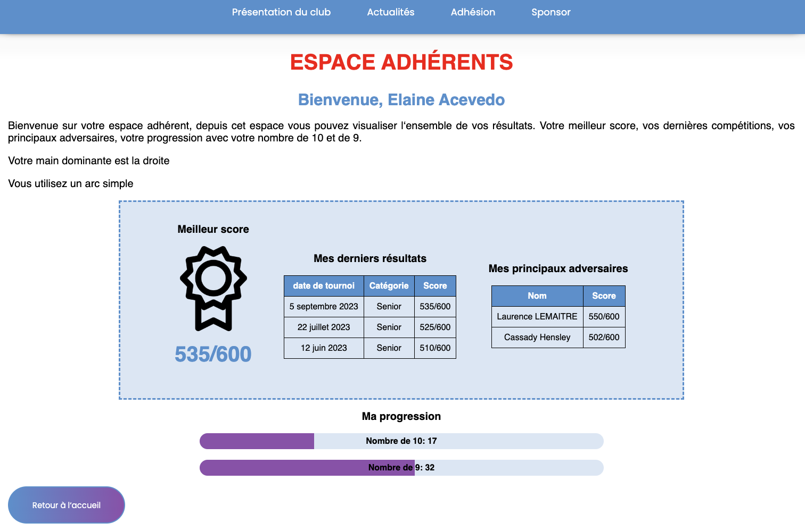
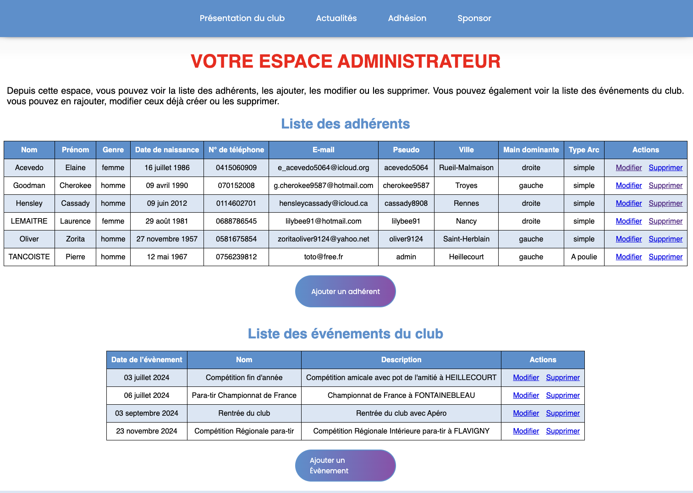

# Projet de fin de Formation

## Développement Web et Accessibilité

Ce site internet est réaliser en NextJS pour le club de tir à l'arc **"Les Archers Sans Limites"** 🏹 de HEILLECOURT (54) en Meurthe et Moselle.

---

> En plus des informations général sur le club, les adhérents peuvent s'inscrirent et se connecter à leur page personnel avec les statistiques sur leurs scores. L'administrateur peut gérer les adhérents et les événements du club.

---

**Pour les besoins de la démonstration j'ai créer 5 comptes adhérents fictifs et un compte Administrateur.**

- 3 avec des scores
  | Identifiant | Mot de passe |
  | ----------- | ------------ |
  | lilybee91 | lolo54 |

  | Identifiant | Mot de passe |
  | ----------- | ------------ |
  | acevedo5064 | ULA03LKU4BF  |

  | Identifiant | Mot de passe |
  | ----------- | ------------ |
  | cassady8908 | FJU53KRR2NP  |

- 2 sans score

  | Identifiant | Mot de passe |
  | ----------- | ------------ |
  | oliver9124  | MWH88NGR7XU  |

  | Identifiant  | Mot de passe |
  | ------------ | ------------ |
  | cherokee9587 | BXU55UVS3GS  |

- 1 compte administrateur

| Identifiant | Mot de passe |
| ----------- | ------------ |
| admin       | admin        |
